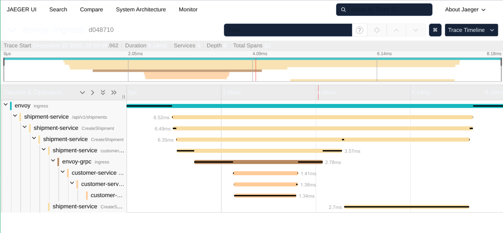

# Shipment-Service + Customer-Service

Тестовое задание с использованием REST API, gRPC, Envoy, PostgreSQL и OpenTelemetry.

## Архитектура

```
[Client] → REST (Envoy:8080) → shipment-service → gRPC (через Envoy:9090) → customer-service → Postgres
```

### Сервисы

- **envoy** — единая точка входа
  - Публикует только REST API на порту `:8080`
  - Имеет внутренний gRPC-listener на порту `:9090` (не пробрасывается наружу)
  - Local rate limit: 10 rps на IP
  - Tracing включён

- **shipment-service** — REST API + gRPC-клиент к customer-service
  - HTTP сервер на порту `:8080` (внутри контейнера)
  - Вызывает customer-service через Envoy gRPC endpoint

- **customer-service** — только gRPC-сервер
  - gRPC сервер на порту `:9090` (внутри контейнера)
  - Обслуживает запросы от shipment-service

- **postgres** — база данных
  - Две связанные таблицы: `customers` и `shipments`

- **otel-collector** — сбор трейсов
- **jaeger** — визуализация трейсов

## Требования

- Go 1.24+
- Docker и Docker Compose
- buf (опционально, для генерации proto файлов)

## Быстрый старт

### Через Docker Compose (рекомендуется)

```bash
make docker-up
# или
docker-compose up -d

# Просмотр логов
make docker-logs

# Остановка
make docker-down
```

Все сервисы запустятся автоматически. Миграции применятся при первом запуске PostgreSQL.


## Makefile команды

```bash
make help    
```

## API

### POST /api/v1/shipments

Создание новой заявки на доставку.

```bash
curl -i -X POST http://localhost:8080/api/v1/shipments \
  -H "Content-Type: application/json" \
  -d '{
    "route": "ALMATY→ASTANA",
    "price": 120000,
    "customer": {
      "idn": "990101123456"
    }
  }'
```

## HTTP Response (201 Created)

### Headers
```http
HTTP/1.1 201 Created
Content-Type: application/json
Date: Tue, 30 Dec 2025 15:04:18 GMT
Content-Length: 204
X-Envoy-Upstream-Service-Time: 9
Server: envoy
```

### Response Body
```json
{
  "id": "shp-uuid",
  "status": "CREATED",
  "customerId": "cus-uuid",
  "route": "ALMATY→ASTANA",
  "price": 120000,
  "created_at": "2025-10-17T10:00:00Z"
}
```

**Логика:**
1. shipment-service валидирует idn (12 цифр)
2. Через gRPC → Envoy → customer-service вызывает `UpsertCustomer(idn)`
3. Получает `customer_id` от customer-service
4. Создаёт запись shipment в БД

### GET /api/v1/shipments/{id}

Получение заявки по ID.

```bash
curl http://localhost:8080/api/v1/shipments/<id>
```

**Ответ (200):**
```json
{
  "id": "shp-uuid",
  "route": "ALMATY→ASTANA",
  "price": 120000,
  "status": "CREATED",
  "customerId": "cus-uuid",
  "created_at": "2025-10-17T10:00:00Z"
}
```

## Трассировка

### Где смотреть трассы

Откройте Jaeger UI: http://localhost:16686

Вы увидите полную цепочку трейсов:
- REST → shipment-service → gRPC → customer-service → DB

### Trace ID в логах

Все логи содержат `trace_id` для корреляции запросов.


## Генерация proto файлов

Проект использует [buf](https://buf.build/) для генерации Go кода из proto файлов:

```bash
# Генерация через buf (рекомендуется)
make proto

# Или вручную
buf generate
```

Файлы генерируются в `api/proto/` и не должны коммититься в репозиторий (см. `.gitignore`).

## Особенности реализации

1. **REST-запрос идёт через Envoy**: Все внешние запросы проходят через Envoy на порту 8080, который маршрутизирует их в shipment-service.

2. **gRPC только внутри сети**: gRPC порт 9090 не пробрасывается наружу, доступен только внутри docker-сети через Envoy.

3. **OpenTelemetry**: Все сервисы инструментированы для трейсинга. Трейсы экспортируются в Jaeger через otel-collector.

4. **Upsert логика**: При повторном POST с тем же idn, customer не дублируется благодаря UNIQUE constraint и логике upsert.

5. **Структура кода**: Код организован по слоям (handlers → service → repo), не монолит в main.go.

6. **Логирование с trace_id**: Все логи содержат trace_id для корреляции запросов.

## Переменные окружения

### customer-service

- `DB_HOST` - хост БД (по умолчанию: localhost)
- `DB_PORT` - порт БД (по умолчанию: 5432)
- `DB_USER` - пользователь БД (по умолчанию: postgres)
- `DB_PASSWORD` - пароль БД (по умолчанию: postgres)
- `DB_NAME` - имя БД (по умолчанию: testovoe)
- `GRPC_PORT` - порт gRPC сервера (по умолчанию: 9090)
- `OTEL_EXPORTER_OTLP_ENDPOINT` - endpoint OpenTelemetry (по умолчанию: localhost:4317)
- `OTEL_SERVICE_NAME` - имя сервиса для трейсинга (по умолчанию: customer-service)

### shipment-service

- `DB_HOST` - хост БД (по умолчанию: localhost)
- `DB_PORT` - порт БД (по умолчанию: 5432)
- `DB_USER` - пользователь БД (по умолчанию: postgres)
- `DB_PASSWORD` - пароль БД (по умолчанию: postgres)
- `DB_NAME` - имя БД (по умолчанию: testovoe)
- `HTTP_PORT` - порт HTTP сервера (по умолчанию: 8080)
- `GRPC_ENVOY_ENDPOINT` - endpoint Envoy для gRPC (по умолчанию: localhost:9090)
- `OTEL_EXPORTER_OTLP_ENDPOINT` - endpoint OpenTelemetry (по умолчанию: localhost:4317)
- `OTEL_SERVICE_NAME` - имя сервиса для трейсинга (по умолчанию: shipment-service)


### Отладка

```bash
# Просмотр логов конкретного сервиса
make docker-logs-customer
make docker-logs-shipment

# Просмотр логов Envoy
make docker-logs-envoy

# Проверка подключения к БД
docker-compose exec postgres psql -U postgres -d testovoe

# Проверка трейсов в Jaeger
# Откройте http://localhost:16686
```